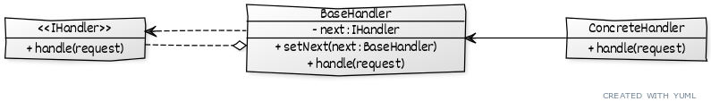

# ```Chain of responsibility```

## Описание
Используется для последовательной обработки запроса.

## Вариации
При возможности обработать запрос текущий обработчик это делает и:
* завершает работу, иначе запрос передается дальше.
* передает его дальше, иначе обработка завершается.

## Сущности
* ```IHandler``` - общий интерфейс обработчиков
* ```BaseHandler``` - содержит общую логику для всех обработчиков
* ```ConcreteHandler``` - реализует конкретное поведение

## Диаграмма
