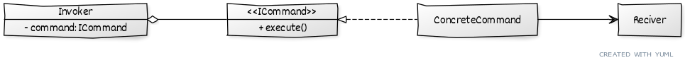

# ```Command```

## Описание
Позволяет отделить логику от представления за счет ее вынесения в классы команд. 

## Сущности
* ```Invoker``` - Вызывает команду
* ```Reciever``` - Над чем выполняется действие
* ```ICommand``` - Выполняет действие над получателем


## Диаграмма
