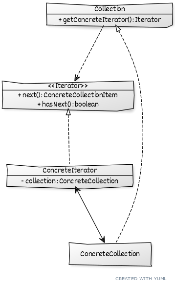

# ```Iterator```

## Описание
Используется для обхода коллекции, отделяя логику обхода от реализации коллекции.

## Сущности
* ```Iterator``` - Общий интерфейс итераторов, содержит метод для движения и флаг завершения
* ```ConcreteIterator``` - Конкретная реализация обхода коллекции
* ```Collection``` - Общий интерфейс для итерируемых коллекций, содержит метод возврата итераторов
* ```ConcreteCollection``` - Конкретная коллекция

## Диаграмма
