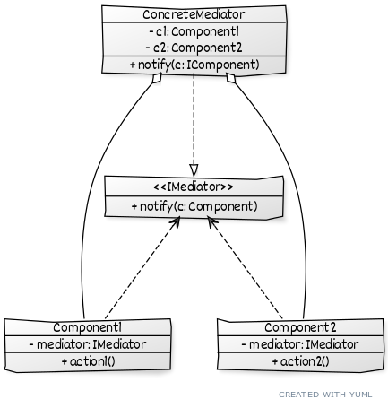

# Mediator

## Описание
Позволяет ослабить связанность между классами, за счет вынесения их связей(отношений) в отдельный класс-посредник. Все связи решаются через посредника.

## Сущности
* `IMediator` - интерфейс всех посредников
* `ConcreteMediator` - конкретный посредник, отвечающий за логику отношений компонентов
* `Component` - компонент, выполняющий свою работу, незнающий о других компонентах

## Диаграмма
