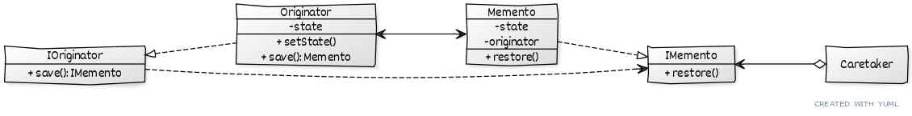

# ```Memento```

## Описание
Позволяет сохранять состояние объекта, не расскрывая внутренней реализации.

## Сущности
* ```Originator``` - оригинальный объект - тот, который необходимо сохранять
* ```Memento``` - копия состояния оригинального объекта
* ```Caretaker``` - управляет сохранением и восстановлением оригинальных объектов


## Диаграма

