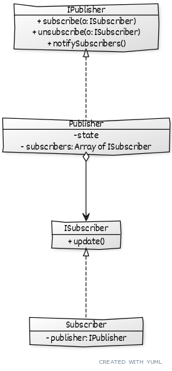

# ```Observer```

## Описание
Позволяет одним объектам узнавать об изменении состояния других объектов

## Сущности
* ```IPublisher(IObservble)``` - объект, в котром происходят изменения
* ```ISubscriber(IObserver)``` - объект, который узнает об изменении в другом

## Диаграма
