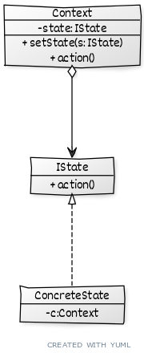

# ```State```

## Описание
Позволяет объектам менять поведение в зависимости от своего состояния

## Сущности
* ```Context``` - может находиться в одном из множества состояний, и выполняющий определенное действие определенным образом в зависимости от этого состояния
* ```State``` - выполняет действие определенным образом 

## Диграма
