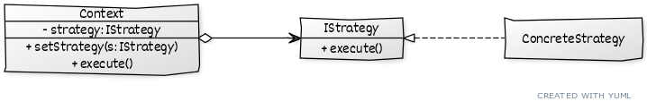

# ```Strategy```

## Описание
Определяет семейство схожих алгоритмов и помещает, каждый из них, в отдельный класс.

## Сущности
* ```Context``` - определяет каким именно образом выполняется алгоритм
* ```Strategy``` - реализует алгоритм определенным образом

## Диаграма
