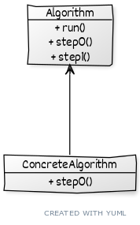

# ```Template method```

## Описание
Определяет последовательность шагов алгоритмов, поручая наследникам реализацию некторых из них.

## Сущности
* ```Algotithm``` - определяет алгоритм(последовательность шагов)
* ```ConcreteAlgorithm``` - конкретная реализация некоторого шага алгоритма

## Диаграма
