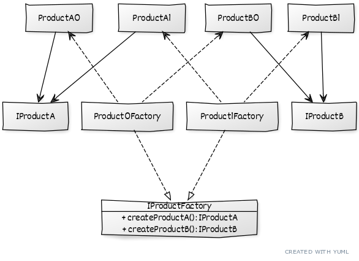

# ```Abstract factory```

# Описание
Позволяет создавать семейства связанных объектов, не привязываясь к КОНКРЕТНЫМ классам создаваемых объектов.

# Сущности
* ```IProductA``` - общий интерфейс для определенного ВИДА продукта
* ```ProductA0``` - конкретный ТИП определенного ВИДА продукта
* ```IProductFactory``` - общий интерфейс для фабрик, с методами для создания каждого ВИДА продукта
* ```Product0Factory``` - фабрика, создающая все ВИДЫ продуктов, конкретного ТИПА

# Диаграмма
