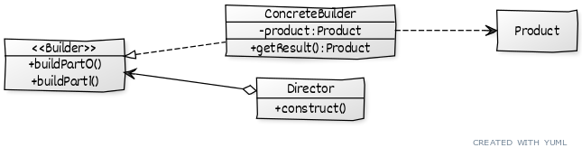
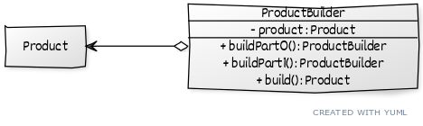

# ```Builder```

## Описание

Используется для ```ПОШАГОВОГО``` создания объекта. Уместен, например, когда есть большой конструктор.
Отделяет конструирование сложного объекта от его представления так, что в результате одного и того же процесса конструирования могут получаться разные представления.

## Пример
Вместо сложного разового построения огромной строки, можно создать ее пошагово, например по слову.

## Сущности

* ```Builder``` - Общий интерфейс для строителей. Содержит методы для построения отдельных частей продукта.
* ```ConcreteBuilder``` - Конкретная реализация строителя.
* ```Product``` - Объект, который строится.
* ```Director``` - Объект, инкапсулириующий логику по строительству определенного (вида) продукта, поручающий строительство строителю.

## Диаграмма

