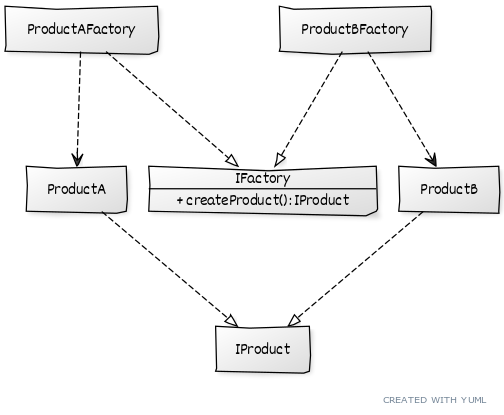

# ```Factory method```

# Описание
Позволяет определить ОБЩИЙ способ создания объектов в суперклассе, давая возможность дочерним ПОДКЛАССАМ переопределить тип создаваемого объекта.

# Сущности
* ```IFactory``` - общий интерфейс фабрики, содержащий метод для создания продукта
* ```ProductAFactory``` - конкртетная фабрика, создающая конкретный продукт
* ```ProductA``` - конкретный продукт
* ```IProduct``` - общий интерфейс продукта

# Диаграмма
