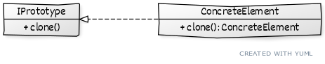

# Prototype

## Описание
Используется для создания копии объекта, не вдаваясь в детали реализации

## Сущности
* ```IPrototype``` - общий интерфейс для прототипов с методом копирования
* ```ConcreteElement``` - конкретный элемент, реализующий интерфейс прототипа

## Диаграмма
