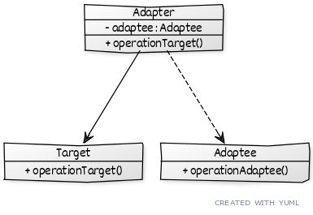

# ```Adapter```

## Описание
Позволяет клиенту использовать несовместимые интерфейсы - один класс, как другой.

## Сущности
* ```Target``` - Класс с которым работает клиент, в который нужно преобразовать
* ```Adaptee``` - Класс, который надо преобразовать
* ```Adapter``` - Преобразует ```Adaptee``` в ```Target```

## Диаграмма
