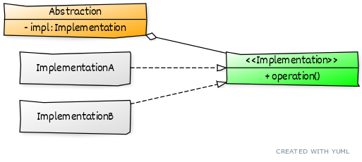

# ```Bridge```

## Описание
Разделяет абстракцию и реализацию - общие,абстрактные действия и реальные, платформозависимые действия.

## Сущности
* ```Abstraction``` - абстракция, содержит общие действия, независомые от платформы
* ```Implementation``` - общий интерфейс реализации
* ```ConcreteImplementation``` - конкретная реализация, выполняющая конкретные действия

## Диаграмма
