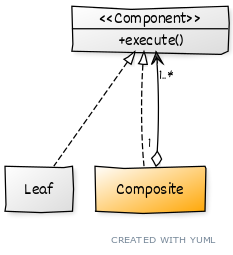

# ```Composite```

## Описание

Используется, когда объекты можно представить в виде дерева. Позволяет работать с такой структурой, как с едининым компонентом.

## Сущности

* ```Leaf``` - простой элемент, самостоятельно выполняющий операцию
* ```Composite``` - элемент, содержащий в себе другие элементы, и выполняющий операции за счет дочерних компонентов.
* ```Component``` - общий интерфейс

## Диаграмма
