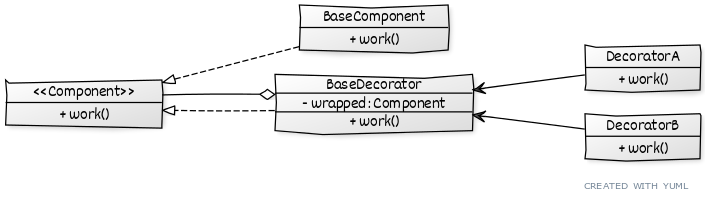

# ```Decorator```

## Описание
Используется для добавления функциональности объектам.

## Сущности
* ```Component``` - общий интерфейс всех компонентов
* ```BaseComponent``` - базовый компонент, для которого требуются дополнения
* ```BaseDecorator``` - базовый декоратор с общей логикой для всех декораторов
* ```ConcreteDecorator``` - конкретный декоратор со своей логикой дополнения

## Диаграмма
