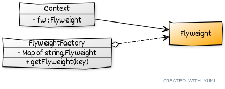

# ```Flyweight```

## Описание
Выносит одинаковые, неизменяемые данные в отдельный класс, создавая его экземпляры только однажды, а специфичные данные остаются на месте. 

## Сущности
* ```Flyweight``` - содержит общие, неизменяемые данные
* ```Context``` - содержит специфичные данные
* ```FlyweightFactory``` - кеш легковесов

## Диаграмма
