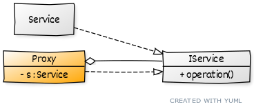

# ```Proxy```

## Описание
Подставляет вместо реальных объектов специальный объект-заместитель, который перехватываеи вызовы к нему.

## Сущности
* ```IService``` - общий интерфейс сервиса
* ```Service``` - сервис, который может быть заменен
* ```Proxy``` - заместитель сервиса

## Диаграмма
